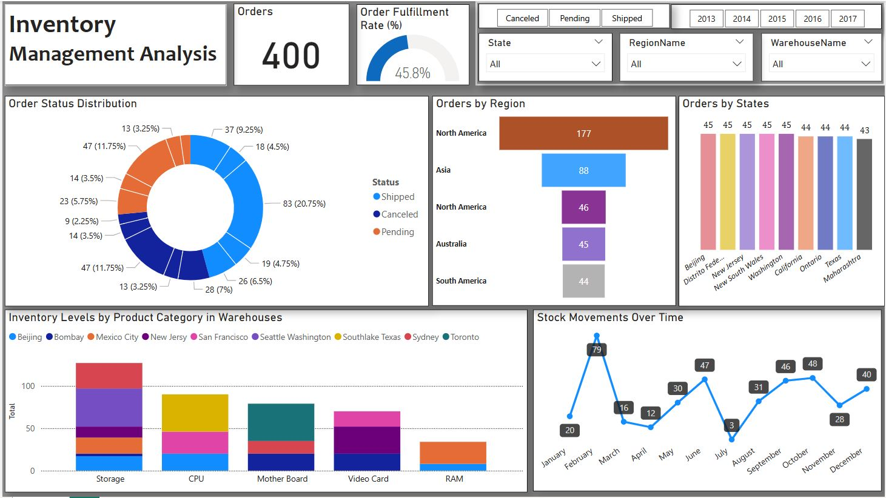

# Inventory-Management-Data-Analysis
Created a project that fulfilling the requirement of Visualize inventory levels, stock movements, and order statuses  across a warehouse.
This Power BI dashboard visualizes inventory performance across multiple warehouses. It highlights key metrics such as order volume, fulfillment rate, and order status distribution. Users can explore inventory levels by product category, analyze regional and state-wise orders, and track monthly stock movements over time.

This interactive inventory management dashboard offers insights into warehouse operations. It allows users to monitor order status (shipped, pending, canceled), view inventory levels by product type and location, and analyze stock movement trends month by month. Filters make it easy to drill down by year, region, or warehouse.

